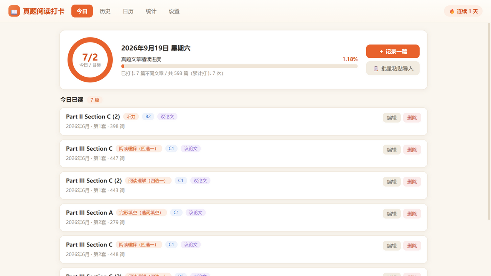
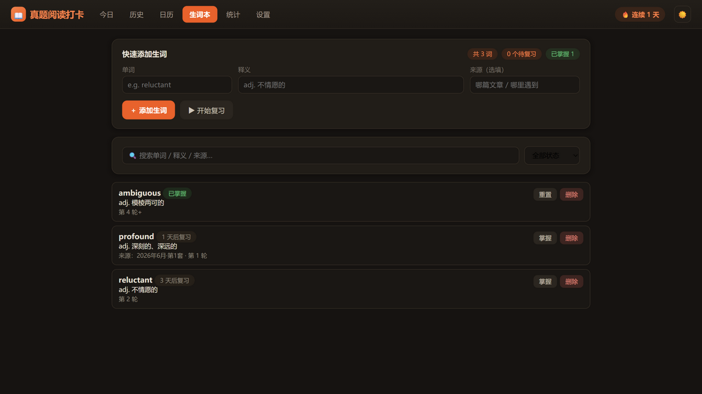
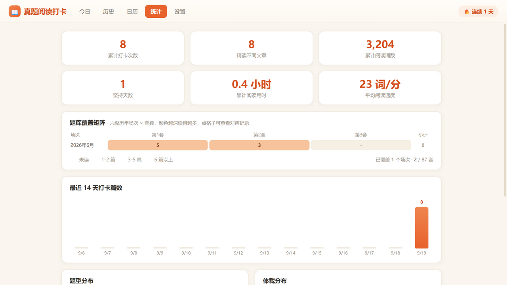
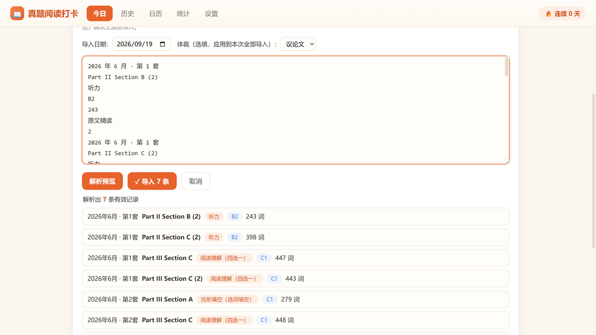

# 真题阅读打卡（CET-6 Reading Log）

一个**单文件、零依赖、可离线**的桌面小工具，用来记录每天阅读的英语六级真题文章（配套懒笔记题库 593 篇）。

数据只保存在本机，不上传任何服务器。

**🌐 线上版**：<https://lii-lii321.github.io/cet6-reading-log/> —— 可直接安装为桌面 / 手机应用（PWA），也可以下载 `index.html` 离线使用。



## ✨ 功能

- **今日打卡** — 每日目标进度环、题库精读总进度条、今日已读列表
- **复习提醒** — 精读过的文章按 7 / 14 / 30 天间隔提醒重读（第 4 遍视为掌握），一键记录重读
- **生词本** — 阅读时随手录生词，莱特纳间隔闪卡复习（1/3/7/21 天），认识升档、忘了重来，掌握情况一目了然
- **批量粘贴导入** — 在懒笔记里框选文章列表复制，粘贴进来自动解析成打卡记录（支持体裁一键应用、重复打卡提醒）
- **题库覆盖矩阵** — 历年场次 × 套数的网格地图，颜色越深读得越多，点格子直达对应记录，一眼看清哪些场次还没碰
- **质量字段与弱项分析** — 每篇可记生词数、错题数、用时，自动计算阅读速度；统计页按题型汇总平均用时 / 速度 / 错题 / 生词，找到弱项
- **本周小结与分享图** — 本周 vs 上周篇数 / 词数 / 用时 / 天数环比；一键生成精美打卡分享图（PNG 下载）
- **深色模式** — 顶栏一键切换，自动记住偏好
- **多题库适配** — 题库名称与总篇数可自定义（六级 / 四级 / 考研英语均可）
- **历史记录** — 按日期分组展示，支持关键词搜索（含套数）、按题型 / 难度 / 考试年月筛选，可编辑、删除（表单内 Ctrl+Enter 快捷保存）
- **打卡日历** — 月历视图，有记录的日期带角标，点某天查看当天明细
- **统计与里程碑** — 累计篇数 / 词数 / 用时 / 速度、最近 14 天柱状图、题型与体裁分布、精读篇数 / 连续天数 / 词数成就徽章
- **数据安全** — JSON 备份导出 / 导入（记录与生词、合并去重）、超过 7 天未备份自动提醒







## 🚀 快速开始

**方式一（推荐）：线上版 / PWA**

用 Edge 或 Chrome 打开 <https://lii-lii321.github.io/cet6-reading-log/>，点地址栏右侧的「安装」图标，即可像桌面软件一样使用；手机浏览器同样可安装。断网也能用（Service Worker 缓存）。

**方式二：本地文件**

1. 下载本仓库的 `index.html`（整仓克隆或直接另存这一个文件都可以）
2. 双击用浏览器打开即可使用；Windows 用户可双击 `打开待办助手.bat`，会以独立窗口（Edge App 模式）打开
3. 建议给 `打开待办助手.bat` 创建桌面快捷方式，方便每天使用

> 注意：本地文件方式和线上版是两个独立的存储空间，数据不互通；从一种方式换到另一种时，用「设置 → 导出备份 / 导入备份」迁移一次即可。

## 📋 批量导入格式

在懒笔记的文章列表页框选复制，粘贴后点「解析预览」。每条记录占多行：

```
2026 年 6 月 · 第 1 套
Part III Section A
完形填空（选词填空）
C1
279
精读
```

- 记录间的序号行、末尾的「原文精读 / 精读」等会自动忽略
- 题型文字自动匹配到标准选项（听力 / 阅读理解（四选一）/ 完形填空（选词填空）等）
- 已打卡过的文章会在预览中标黄提醒

## 🔒 数据与隐私

- 所有数据保存在**本机浏览器的 localStorage**，不联网、不上传
- 换电脑、重装系统或清理浏览器数据前，请先在「设置」页**导出备份**（JSON 文件）
- 恢复时用「导入备份」，支持与现有记录合并去重

## 🛠 技术说明

- 纯原生 HTML / CSS / JavaScript 单文件实现，无任何框架、构建步骤和外部依赖
- 隐私优先：无统计、无追踪、无外部请求

## License

[MIT](LICENSE)
